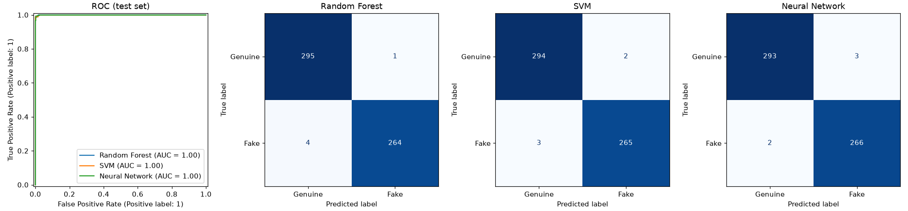

# Fake Profile Detection

[](https://github.com/Saiharshith007/Fake-Profile-Detection/actions/workflows/ci.yml)

This project classifies X (formerly Twitter) accounts as genuine or fake using five public profile counts. It compares a Random Forest, an SVM and a small neural network built with scikit-learn.



## Results

The models are scored on a held-out, stratified test set: 20% of the data, or 564 profiles. "Fake" is the positive class.

| Model | CV accuracy (5-fold, train) | Test accuracy | Precision | Recall | F1 | ROC AUC |
|---|---|---|---|---|---|---|
| Random Forest | 0.992 ± 0.007 | 0.991 | 0.996 | 0.985 | 0.991 | 1.000 |
| SVM (RBF) | 0.993 ± 0.006 | 0.991 | 0.993 | 0.989 | 0.991 | 1.000 |
| Neural network (MLP) | 0.992 ± 0.007 | 0.991 | 0.989 | 0.993 | 0.991 | 1.000 |

These scores reflect how easy this dataset is. They don't show that the models detect bots in general. See [Limitations](#limitations).

## Quickstart

Requires Python 3.10+.

```bash
git clone https://github.com/Saiharshith007/Fake-Profile-Detection.git
cd Fake-Profile-Detection
python -m venv .venv
source .venv/bin/activate        # Windows: .venv\Scripts\activate
pip install -e ".[dev]"

python -m fake_profiles.train    # prints the results table, writes reports/results.png
pytest
```

## How it works

| | |
|---|---|
| **Data** | `data/genuine.csv` has 1,481 verified human accounts and `data/fake.csv` has 1,337 purchased fake followers. |
| **Features** | `statuses_count`, `followers_count`, `friends_count`, `favourites_count`, `listed_count` |
| **Models** | The Random Forest uses the raw counts. The SVM and MLP use `log1p` + standardised counts. Scaling happens inside a scikit-learn `Pipeline`, so it is fitted on training data only. |
| **Evaluation** | A stratified 80/20 split with a fixed seed. 5-fold CV on the training set measures how much accuracy varies between folds. ROC AUC is computed from model scores, not from hard labels. |

## Limitations

- **The task is easy.** The fake accounts are bought followers that barely post. Their median is 36 tweets and 0 likes, against 992 tweets and 29 likes for genuine accounts. Near-perfect scores reflect this, and modern bots would not be that easy to detect.
- **The data is old.** It was collected in 2012–2013, when the platform was still Twitter. Both the API fields and bot behaviour have changed since it became X.
- **The classes differ by more than fakeness.** Genuine accounts are mostly Italian and the fakes are English. Any feature tied to language or region (`lang`, `time_zone`, first names) lets a model recognise the source dataset instead of fake accounts. For this reason, the model uses neither `lang` nor name-based features. In testing, adding them did not improve accuracy.

## Extending to other platforms

The five features are generic activity signals: posts, followers, following, likes and list memberships. Most social networks expose something similar, so the same pipeline can be applied to Instagram, Facebook or other platforms:

1. Add the platform's genuine and fake account CSVs under `data/`.
2. Map their columns to the features in `fake_profiles/data.py`, using the closest equivalents. For example, Instagram's media count becomes posts and its follows count becomes following.
3. Train and report results separately for each platform. A model trained on X won't transfer as-is, because account behaviour differs between networks.

Only X (Twitter) has been evaluated so far.

## Project layout

```
fake_profiles/
  data.py      loads the CSVs; defines features and labels
  train.py     models, evaluation and plots (entry point)
tests/         label alignment test + model smoke test
data/          dataset (see below)
reports/       generated figures
```

## Data

The data comes from the E13 (genuine) and INT (fake) subsets of the MIB fake-followers dataset: S. Cresci, R. Di Pietro, M. Petrocchi, A. Spognardi and M. Tesconi, ["Fame for sale: efficient detection of fake Twitter followers"](https://doi.org/10.1016/j.dss.2015.09.003), *Decision Support Systems* 80 (2015). Check the dataset's terms before you reuse it.
